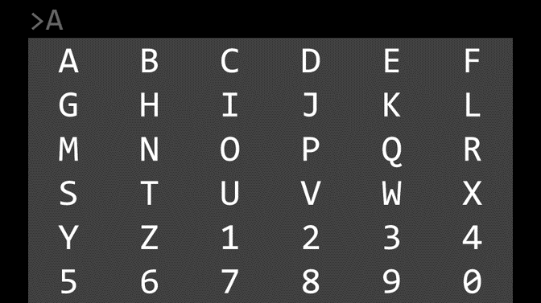

# P300-signal-detection

## 背景和意义

大脑是人体中高级神经活动的中枢，拥有着数以亿计的神经元，并通过相互连接来传递和处理人体信息。脑电信号按其产生的方式可分为诱发脑电信号和自发脑电信号。诱发脑电信号是通过某种外界刺激使大脑产生电位变化从而形成的脑电活动；自发脑电信号是指在没有外界特殊刺激下，大脑自发产生的脑电活动。

（1）诱发脑电信号（P300脑-机接口）
在日常生活中，人的大脑控制着感知、思维、运动及语言等功能，且以外围神经为媒介向身体各部分发出指令。因此，当外围神经受损或肌肉受损时，大脑发出指令的传输通路便会受阻，人体将无法正常完成大脑指令的输出，也就失去了与外界交流和控制的能力。研究发现，在外围神经失去作用的情况下，人的大脑依旧可以正常运行，而且其发出指令的部分信息可以通过一些路径表征出来。脑-机接口技术旨在不依赖正常的由外围神经或肌肉组织组成的输出通路的通讯系统，实现大脑与外部辅助设备之间的交流沟通。
P300事件相关电位是诱发脑电信号的一种，在小概率刺激发生后300毫秒范围左右出现的一个正向波峰（相对基线来说呈现向上趋势的波）。由于个体间的差异性，P300的发生时间也有所不同，图1表示的是在刺激发生后450毫秒左右的P300波形。P300电位作为一种内源性成分，它不受刺激物理特性影响，与知觉或认知心理活动有关，与注意、记忆、智能等加工过程密切相关。基于P300的脑-机接口优点是使用者无需通过复杂训练就可以获得较高的识别准确率，具有稳定的锁时性和高时间精度特性。

## 目标

提供了8个渐冻症被试（S1-S8）的P300脑机接口实验数据，平均年龄为50岁。在实验的过程中，要求每一位被试（被测试者）集中注意力。P300脑机接口实验的设计如下：每位被试能够观察到一个由36个字符组成的字符矩阵，如图3所示，字符矩阵以行或列为单位（共6行6列）。每轮实验的设计流程：首先，提示被试注视“目标字符”，例如在图3的字符矩阵上方，出现的灰色字符“A”；其次，进入字符矩阵的闪烁模式，每次以随机的顺序闪烁字符矩阵的一行或一列，闪烁时长为125毫秒，间隔为125毫秒；最后，当所有行和列均闪烁一次后，则结束一轮实验。在被试注视“目标字符”的过程中，当目标字符所在行或列闪烁时，脑电信号中会出现P300电位；而当其他行和列闪烁时，则不会出现P300电位。上述实验流程为1轮，共重复10轮。

  

